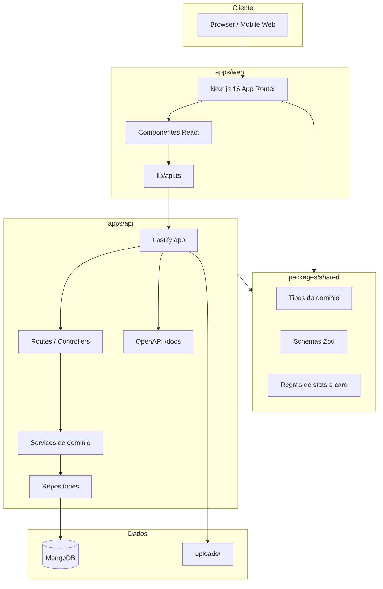
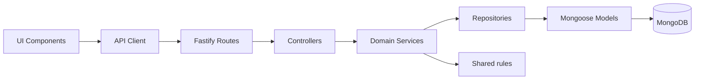
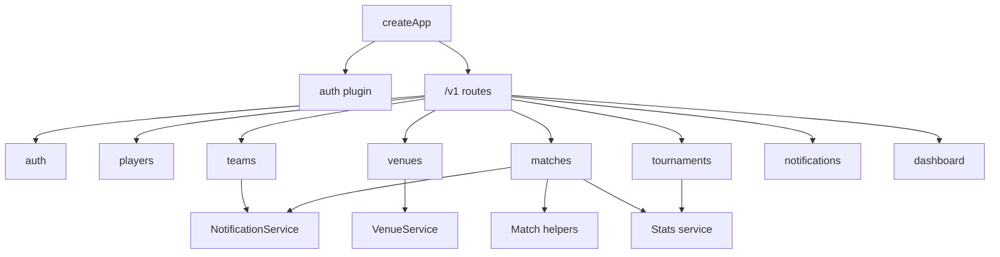
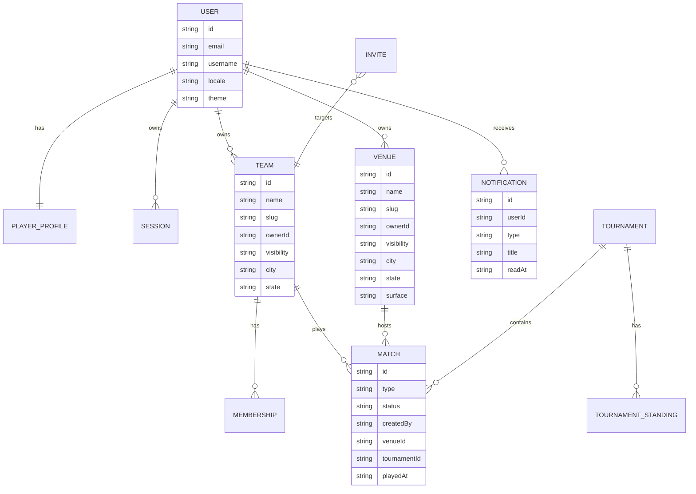
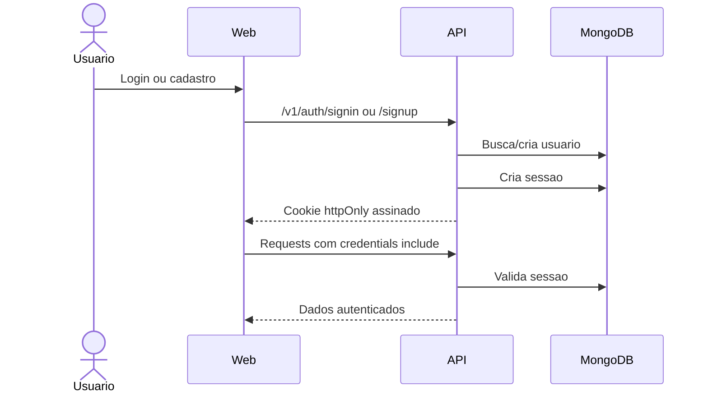
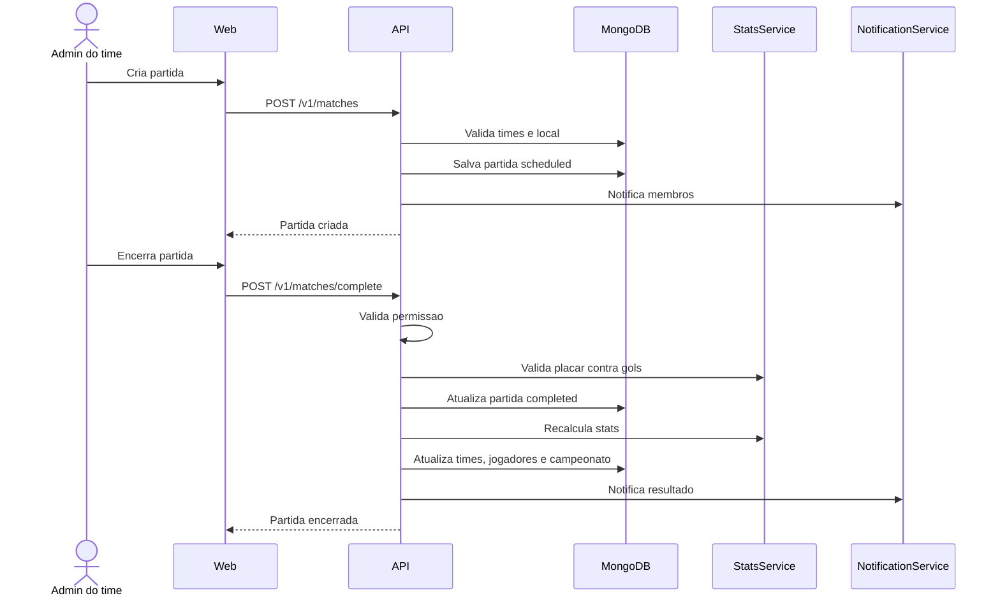
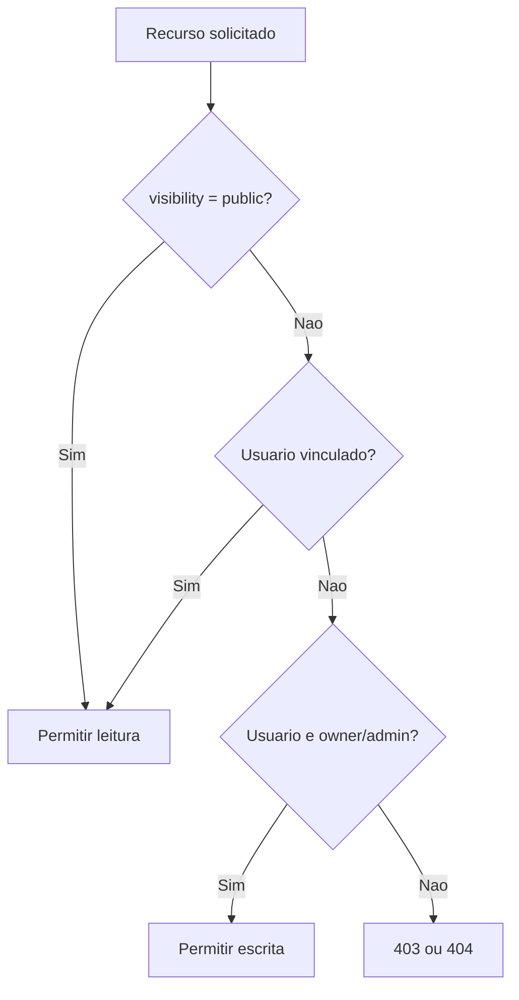
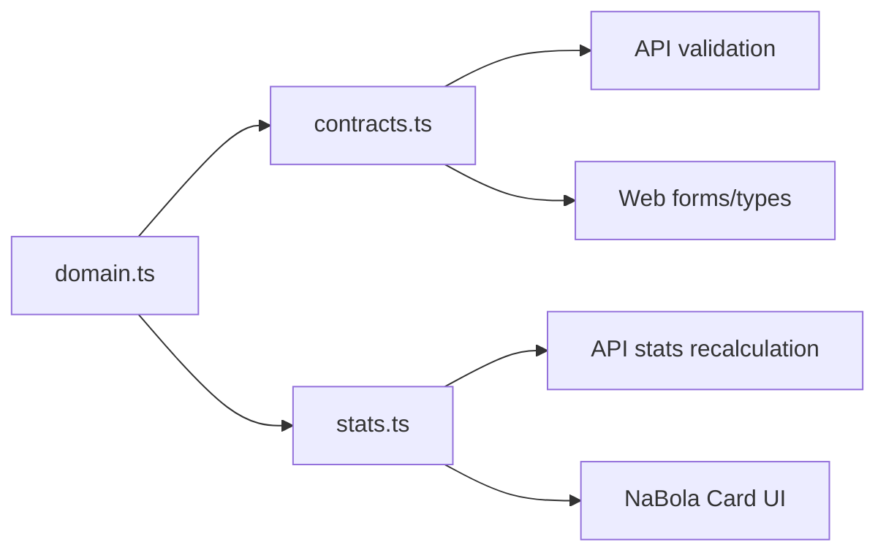

# Arquitetura NaBola

Este documento descreve a arquitetura atual do monorepo NaBola e os principais fluxos de dados entre frontend, backend, pacote compartilhado e MongoDB.

## Visao geral



## Camadas



Responsabilidades:

- `apps/web`: experiencia do usuario, formularios, navegacao e consumo da API.
- `apps/api`: autenticacao, autorizacao, regras de negocio, OpenAPI e persistencia.
- `packages/shared`: contratos, tipos e regras puras reaproveitadas por web e API.
- MongoDB: fonte persistente de usuarios, sessoes, times, partidas, locais, campeonatos e notificacoes.

## Modulos da API



Padrao recomendado para novos dominios:

```text
apps/api/src/modules/<domain>/
|- <domain>.routes.ts
|- <domain>.controller.ts
|- <domain>.service.ts
|- <domain>.schemas.ts
|- <domain>.model.ts
|- <domain>.repository.ts
```

Nem todo modulo precisa ter todos os arquivos no inicio. A regra pratica: handlers ficam finos; regra de negocio vai para service; persistencia fica atras de repository/model.

## Persistencia



Observacoes:

- `matches.eventLog` continua embutido na partida nesta fase.
- `matches.venue` guarda snapshot do local para preservar historico.
- Stats cacheadas podem existir em time, jogador e campeonato.
- A fonte auditavel das stats e: partidas concluidas + sumula/eventLog.

## Fluxo de autenticacao



## Fluxo de partida e stats



## Visibilidade e autorizacao



Regras atuais:

- Times, locais e campeonatos podem ser `public` ou `private`.
- Escrita exige dono/admin quando o recurso pertence a um time.
- Local privado so pode ser usado pelo dono.
- Partida so pode ser encerrada por admin/owner dos dois times envolvidos.

## Contratos compartilhados



O pacote compartilhado deve receber:

- Tipos usados por web e API.
- Schemas Zod de payloads e responses.
- Funcoes puras de stats, ratings e heuristicas do NaBola Card.

Evite colocar nele:

- Codigo com dependencia de Fastify.
- Codigo com dependencia de React.
- Codigo com acesso a banco ou filesystem.

## Decisoes tecnicas

- `pnpm` e o gerenciador padrao.
- MongoDB e acessado via Mongoose na API.
- OpenAPI fica registrado em `apps/api/src/docs/openapi.ts`.
- Uploads locais ficam em `apps/api/uploads`.
- Cookies de sessao sao `httpOnly`, assinados e `sameSite=lax`.
- Notificacoes sao in-app nesta fase; sem email/push.
- Campeonatos comecam em formato `league`.

## Validacao

Use a validacao completa antes de merge/release:

```bash
pnpm lint
pnpm typecheck
pnpm test
pnpm build
```

## Docs Backend

Para detalhes aprofundados da API, schemas MongoDB, fluxos de dominio e operacao:

- [docs/backend/README.md](./docs/backend/README.md)
- [docs/backend/mongo-collections.md](./docs/backend/mongo-collections.md)
- [docs/backend/domain-flows.md](./docs/backend/domain-flows.md)
- [docs/backend/operations.md](./docs/backend/operations.md)
