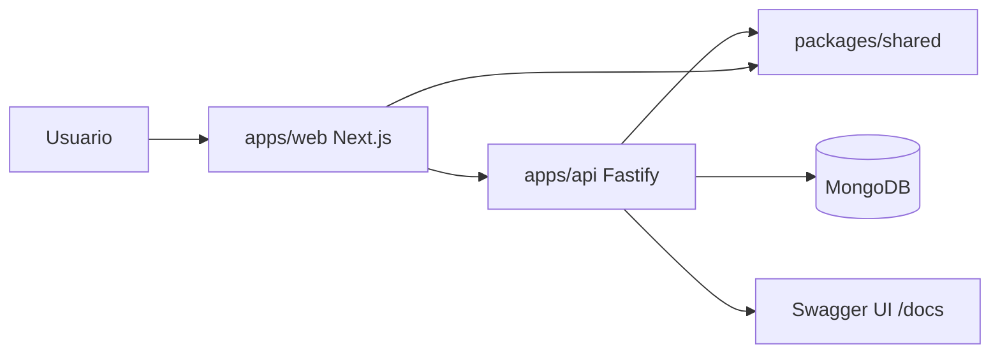
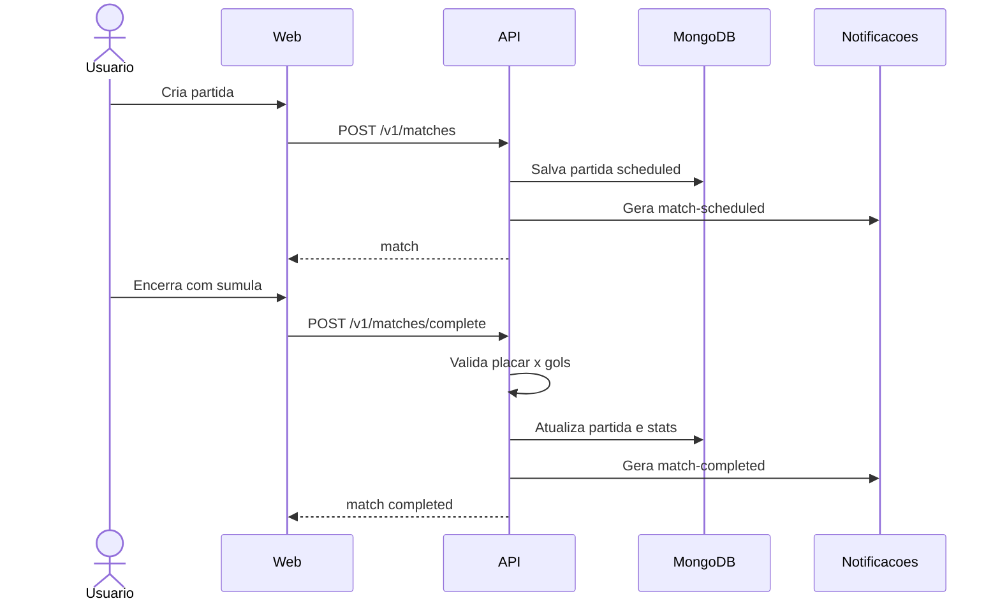

# NaBola

NaBola e um app mobile-first para organizar futebol amador: peladas, times, partidas, locais, campeonatos, convites, notificacoes e estatisticas reais a partir da sumula.

O projeto nasceu como `soccer-stats`, mas o produto tratado na aplicacao e o NaBola.

## Stack

- Monorepo com `pnpm workspaces`
- Web: Next.js 16, React 19, Tailwind CSS, Vitest
- API: Fastify 5, TypeScript, Zod, OpenAPI, Mongoose
- Banco: MongoDB
- Compartilhado: `packages/shared` com tipos, contratos Zod e regras de stats
- Infra local: Docker Compose

## Apps

```text
.
|- apps/
|  |- web/       # Frontend Next.js
|  |- api/       # Backend Fastify
|- packages/
|  |- shared/    # Tipos, schemas e regras compartilhadas
|- docker/
|- docker-compose.dev.yml
|- docker-compose.prod.yml
```

## Funcionalidades

- Autenticacao com email/senha e Google
- Sessao por cookie `httpOnly`
- Perfil de jogador
- Times publicos ou privados
- Convites para times
- Locais/estadios publicos ou privados
- Partidas casuais e de campeonato
- Snapshot do local usado na partida
- Encerramento de partida com validacao da sumula
- Estatisticas de time, jogador e campeonato
- Campeonatos locais em formato liga
- Notificacoes in-app
- Dashboard agregado
- Documentacao OpenAPI em `/docs`

## Quickstart

### Requisitos

- Node.js compativel com Next.js 16
- pnpm 11
- Docker, se quiser rodar MongoDB pelo Compose

### Opcao 1: Docker Compose

```bash
docker compose -f docker-compose.dev.yml up --build
```

URLs:

- Web: `http://localhost:3000`
- API: `http://localhost:4000`
- OpenAPI: `http://localhost:4000/docs`
- MongoDB: `mongodb://localhost:27017`

### Opcao 2: Local com MongoDB separado

1. Instale dependencias:

```bash
pnpm install
```

2. Configure ambiente:

```bash
copy apps\api\.env.example apps\api\.env
copy apps\web\.env.example apps\web\.env
```

3. Suba um MongoDB local ou via Docker:

```bash
docker compose -f docker-compose.dev.yml up mongo
```

4. Rode web e API:

```bash
pnpm dev
```

## Variaveis principais

API:

```env
PORT=4000
MONGODB_URI=mongodb://localhost:27017
MONGODB_DB=soccer_stats
WEB_ORIGIN=http://localhost:3000
SESSION_SECRET=change-me
GOOGLE_CLIENT_ID=
NODE_ENV=development
```

Web:

```env
NEXT_PUBLIC_API_URL=http://localhost:4000/v1
NEXT_PUBLIC_GOOGLE_CLIENT_ID=
```

## Comandos uteis

```bash
pnpm dev
pnpm lint
pnpm typecheck
pnpm test
pnpm build
```

Por pacote:

```bash
pnpm --filter web dev
pnpm --filter web build
pnpm --filter api dev
pnpm --filter api test
pnpm --filter @soccer-stats/shared typecheck
```

## Arquitetura

Visao resumida:



Fluxo de partida:



Mais detalhes estao em [ARCHITECTURE.md](./ARCHITECTURE.md).

## Rotas principais

Frontend:

- `/`
- `/login`
- `/app`
- `/app/matches`
- `/app/matches/[matchId]`
- `/app/teams`
- `/app/teams/[teamId]`
- `/app/tournaments`
- `/app/tournaments/[tournamentId]`
- `/app/profile`
- `/app/notifications`

API:

- `GET /health`
- `GET /docs`
- `POST /v1/auth/signup`
- `POST /v1/auth/signin`
- `GET /v1/dashboard`
- `GET /v1/teams`
- `POST /v1/teams`
- `POST /v1/teams/invites`
- `GET /v1/venues`
- `POST /v1/venues`
- `POST /v1/matches`
- `POST /v1/matches/complete`
- `GET /v1/notifications`

## Validacao antes de PR/release

```bash
pnpm lint
pnpm typecheck
pnpm test
pnpm build
```

Para mudancas somente na API:

```bash
pnpm --filter api typecheck
pnpm --filter api test
pnpm --filter api build
```

Para mudancas somente no frontend:

```bash
pnpm --filter web typecheck
pnpm --filter web test
pnpm --filter web build
```

## Documentos relacionados

- [ARCHITECTURE.md](./ARCHITECTURE.md)
- [docs/backend](./docs/backend/README.md)
- [docs/backend/mongo-collections.md](./docs/backend/mongo-collections.md)
- [MODEL_SYSTEM_GUIDE.md](./MODEL_SYSTEM_GUIDE.md)
- [apps/web/docs/nabola-brand-system.md](./apps/web/docs/nabola-brand-system.md)
- [apps/web/docs/nabola-evolution-roadmap.md](./apps/web/docs/nabola-evolution-roadmap.md)
- [apps/web/docs/nabola-execution-plan.md](./apps/web/docs/nabola-execution-plan.md)
