# Fluxos de Dominio

Este documento descreve os fluxos principais da API e as regras que precisam continuar verdadeiras durante evolucoes.

## Autenticacao e sessao

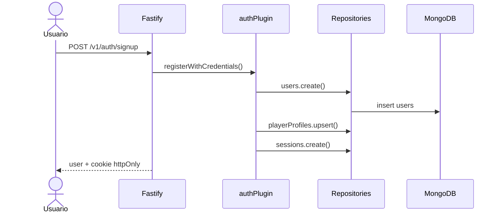

Regras:

- Sessao usa cookie `soccer_stats_session`.
- Cookie e `httpOnly`, assinado, `sameSite=lax`.
- Em producao, cookie usa `secure`.
- `requireUser` valida cookie, sessao, expiracao, revogacao e usuario.
- Sessao registra `userAgent`, `ipHash`, `lastSeenAt` e `revokedAt`.
- `GET /v1/auth/sessions` lista sessoes do usuario.
- `DELETE /v1/auth/sessions/:sessionId` revoga uma sessao.
- `POST /v1/auth/signout-all` revoga as outras sessoes.

## CSRF em mutacoes

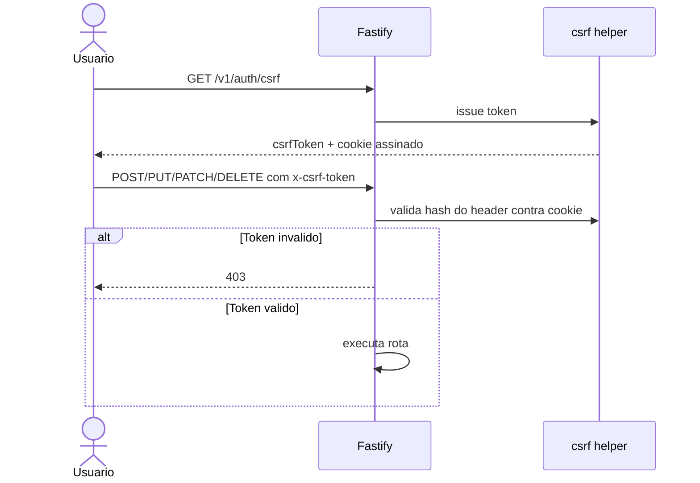

Regras:

- Double-submit token para rotas mutaveis sob `/v1`.
- Header exigido: `x-csrf-token`.
- Rotas de signup/signin/google/csrf sao excecoes para permitir bootstrap da sessao.
- O frontend chama `/auth/csrf` automaticamente antes de mutacoes autenticadas.

## Criacao de time

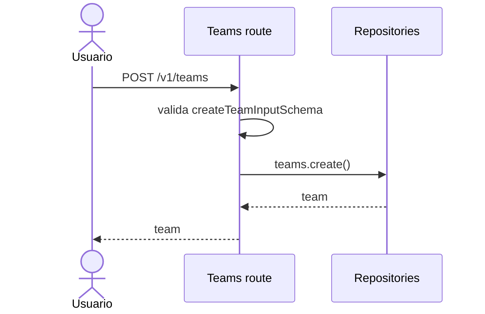

Regras:

- Criador vira membro `owner`.
- `visibility` default e `private`.
- `slug` e gerado com sufixo de ID.
- Stats iniciais usam `createEmptyStats()`.

## Convite de time

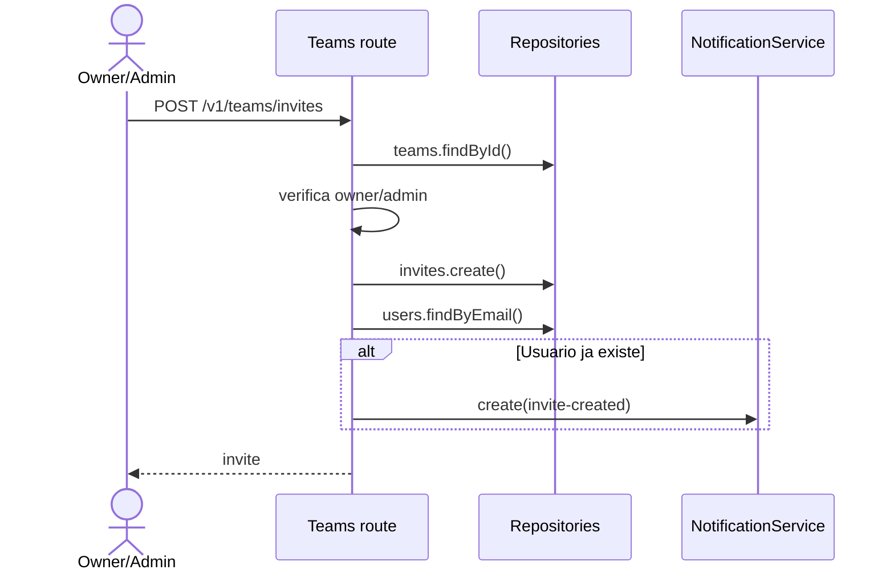

Regras:

- Apenas owner/admin do time pode convidar.
- Convite tem `token` e `expiresAt`.
- Se o e-mail ja pertence a usuario existente, cria notificacao in-app.

## Cadastro e uso de local

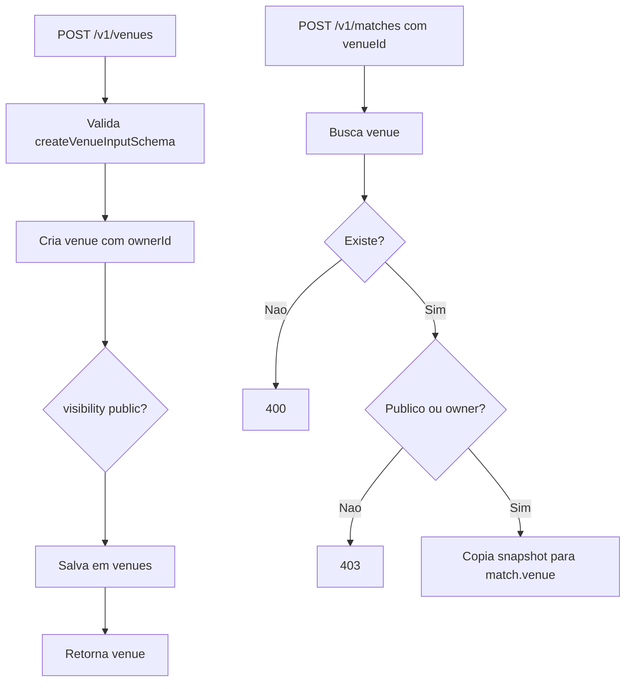

Regras:

- Local privado so pode ser editado/usado pelo dono.
- Local publico pode ser usado por outros usuarios.
- Partida salva `venueId` e snapshot em `venue`.

## Criacao de partida

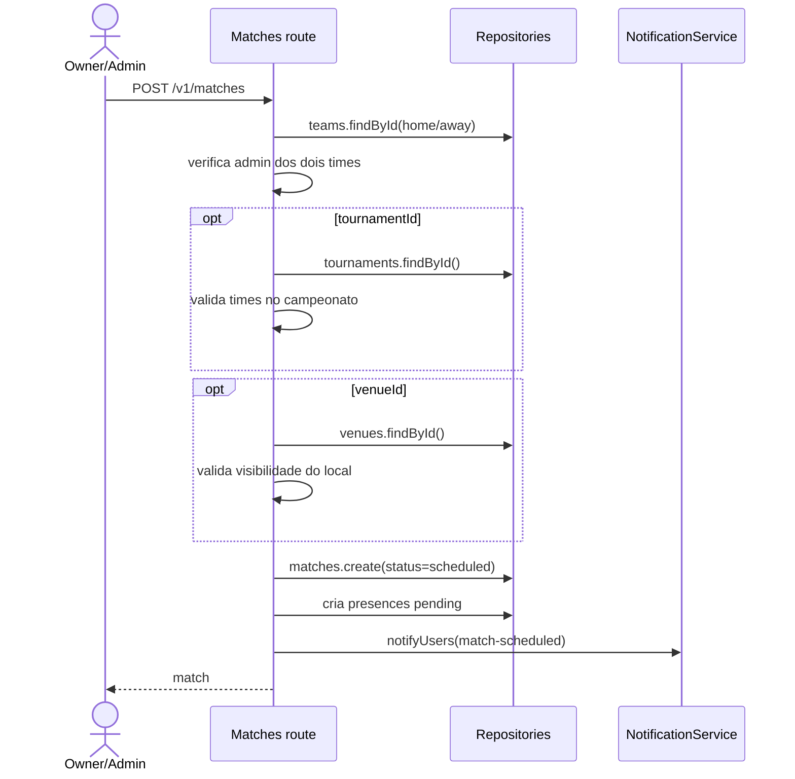

Regras:

- Criacao exige permissao de owner/admin nos dois times.
- Partida de campeonato precisa ter os dois times no campeonato.
- `eventLog` inicia vazio.
- `presences` inicia com status `pending` para jogadores de `home.playerIds` e `away.playerIds`.
- Notifica membros dos times envolvidos.

## Presenca em partida

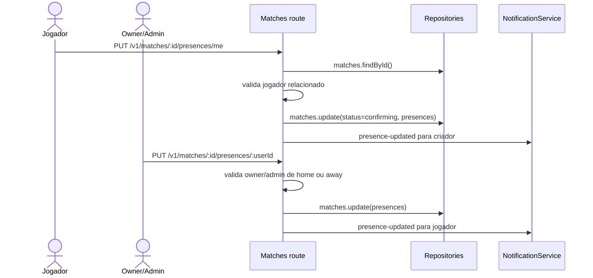

Regras:

- Status possiveis: `pending`, `confirmed`, `declined`, `maybe`.
- Primeira atualizacao muda partida `scheduled` para `confirming`.
- Usuario comum so altera a propria presenca.
- Owner/admin pode alterar presenca de jogador relacionado a partida.

## Cancelamento de partida

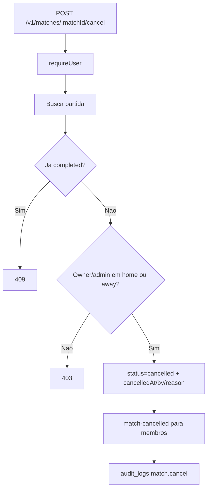

Regras:

- Partida concluida nao pode ser cancelada.
- Partida cancelada nao pode ser encerrada depois.

## Encerramento de partida

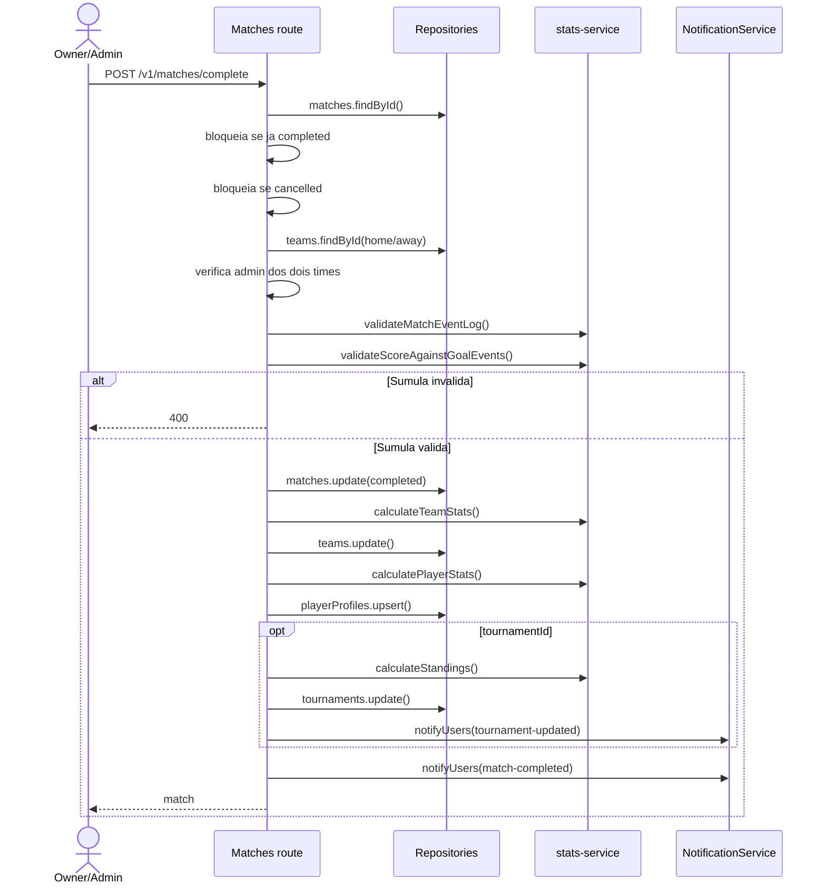

Regras:

- Partida concluida nao pode ser encerrada novamente.
- Partida cancelada nao pode ser encerrada.
- Sumula rejeita jogador fora da partida, time fora da partida, minuto maior que `durationMinutes` e assistente igual ao autor.
- Placar final deve bater com a quantidade de eventos `goal` por time.
- Stats de time usam placar.
- Stats de jogador usam participacao + eventos de gol/assistencia.
- Standings de campeonato sao recalculados quando a partida pertence a campeonato.

## Calculo de stats

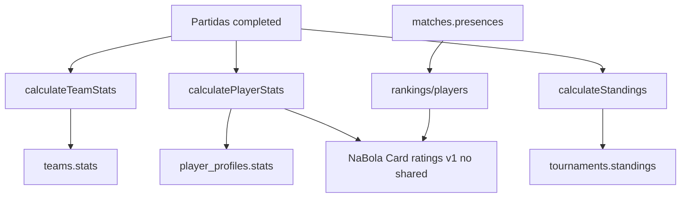

Fonte de verdade:

- Times: partidas concluidas em que o time esta em `home` ou `away`.
- Jogadores: partidas concluidas em que o usuario esta em `playerIds`.
- Gols: eventos `goal`.
- Assistencias: eventos `assist` ou `goal.assistPlayerId`.
- Campeonatos: partidas concluidas do `tournamentId`.
- Ranking considera stats reais, presenca confirmada e `ratingVersion = v1`.

## Rankings e heuristica

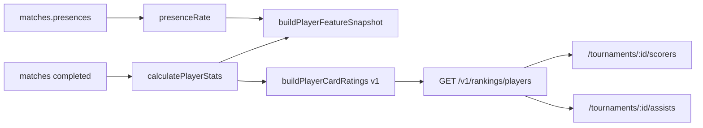

Metricas:

- `overall`
- `goals`
- `assists`
- `presence`
- `winning`
- `form`

Observacao: ML real ainda nao foi implementado. O backend ja gera snapshot de features para preparar dataset futuro.

## Notificacoes

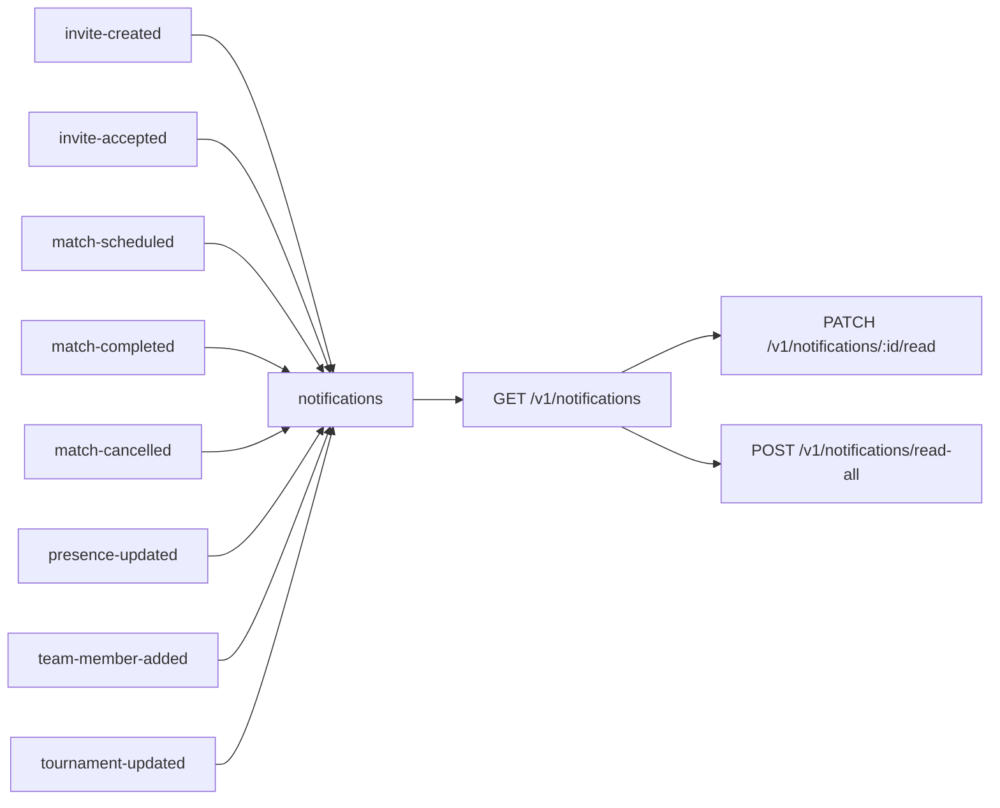

Regras:

- Notificacoes sao in-app.
- `readAt` ausente significa nao lida.
- `metadata` guarda IDs relacionados como `teamId`, `matchId`, `tournamentId`, `inviteId`.

## Visibilidade e permissao

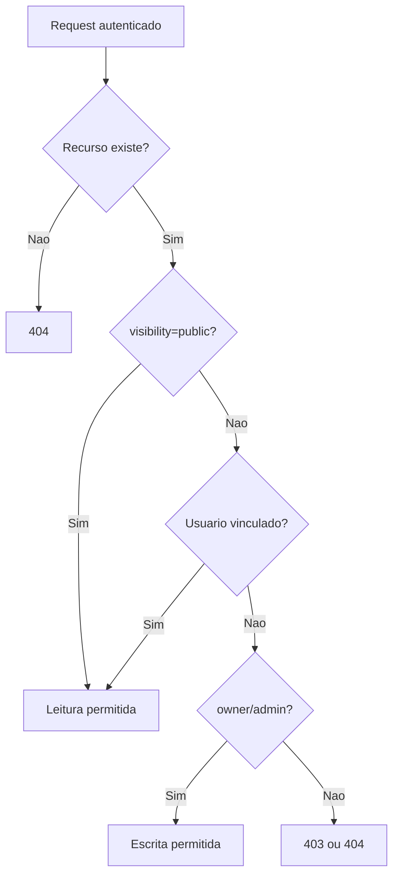

Convencoes:

- Para leitura de recurso privado inexistente/sem acesso, preferir `404` quando nao quiser revelar existencia.
- Para acao administrativa sem permissao, usar `403`.
- Rotas autenticadas chamam `app.auth.requireUser`.
