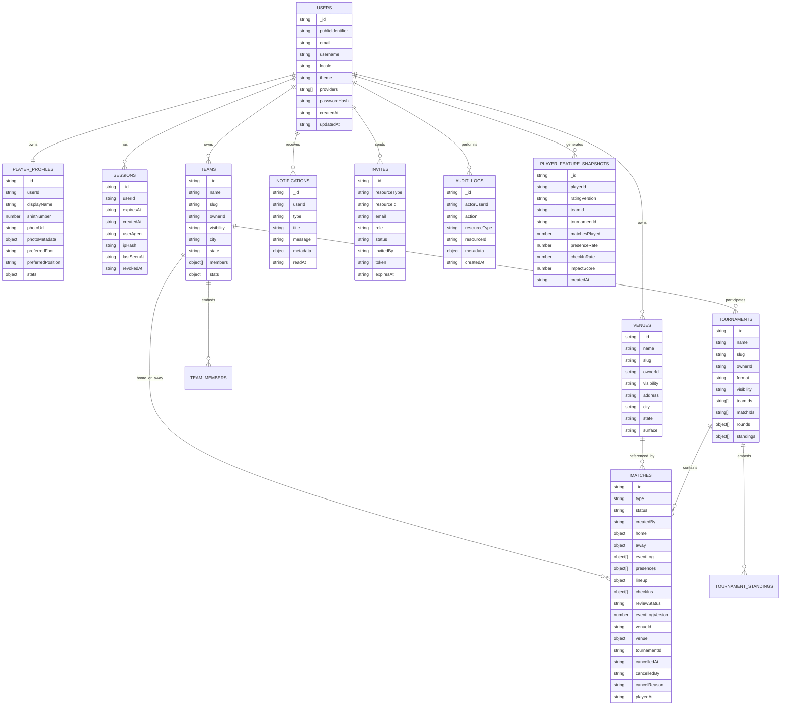
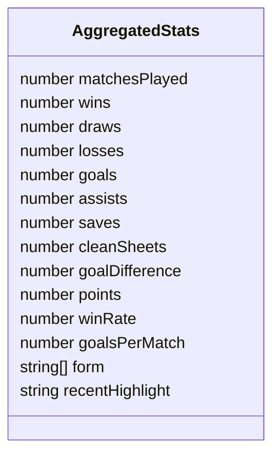
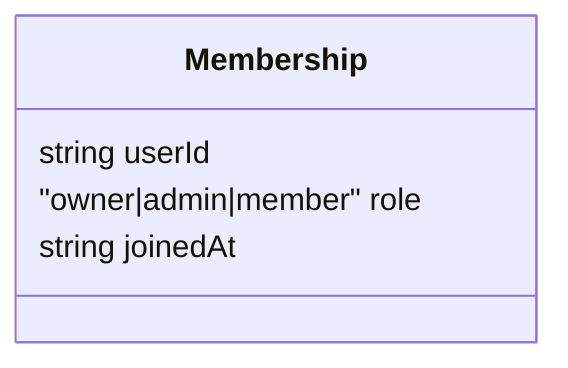
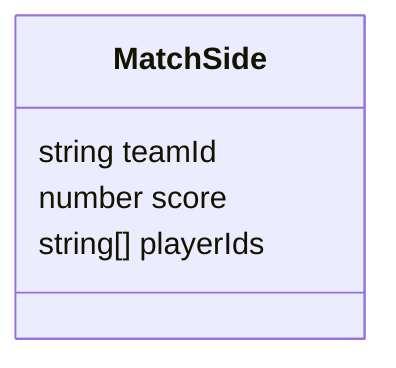
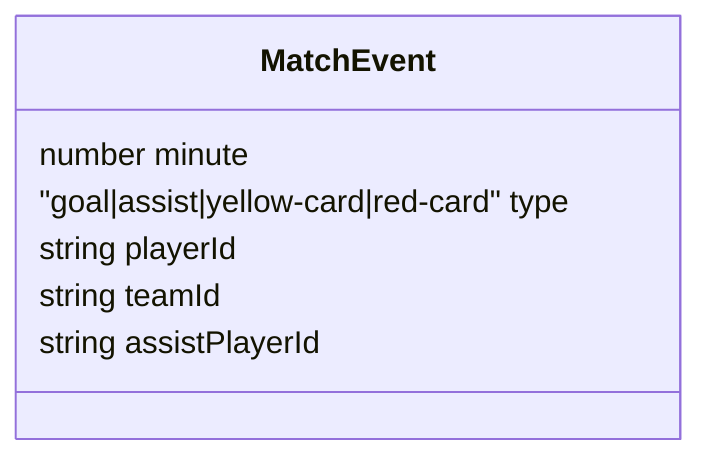
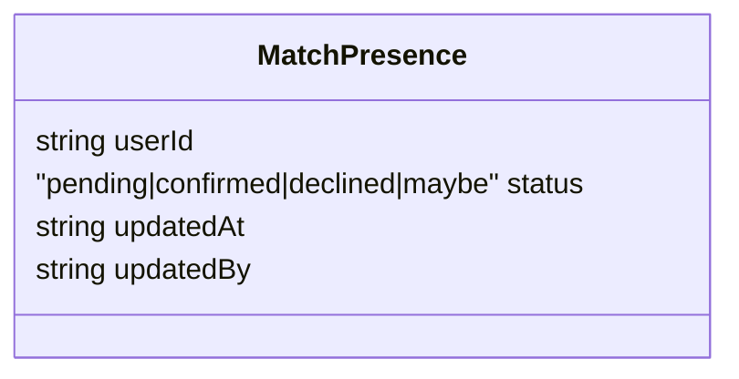
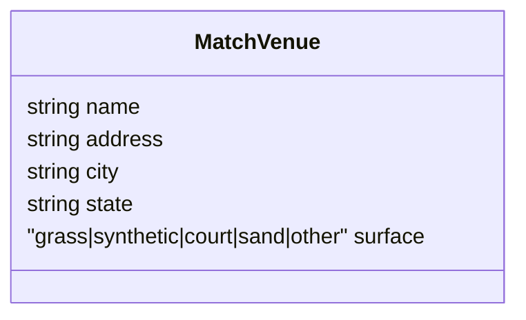
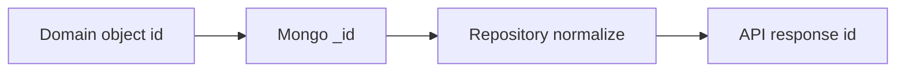

# Collections MongoDB

Fonte de verdade atual dos schemas Mongoose: `apps/api/src/repositories/mongo.ts`.

O dominio TypeScript/Zod compartilhado fica em `packages/shared/src/domain.ts` e `packages/shared/src/contracts.ts`.

## ERD das collections

## Subdocumentos compartilhados

### `stats`

Usado em `teams.stats`, `player_profiles.stats` e `tournaments.standings.stats`.

Regras:

- `matchesPlayed`, `wins`, `draws`, `losses`, `goals`, `assists`, `saves`, `cleanSheets`, `points`, `winRate`, `goalsPerMatch` nao podem ser negativos.
- `form` aceita apenas `W`, `D`, `L`.
- Campos derivados como `winRate` e `goalsPerMatch` sao calculados por `packages/shared/src/stats.ts`.

### `membership`

Embutido em `teams.members`.

### `matchSide`

Embutido em `matches.home` e `matches.away`.

### `matchEvent`

Embutido em `matches.eventLog`.

Regras:

- `minute` vai de `0` a `130`.
- Gols oficiais para stats saem de eventos `type = goal`.
- Assistencias podem vir de evento `assist` ou de `goal.assistPlayerId`.
- O placar de encerramento deve bater com os eventos de gol.
- O jogador precisa estar em `home.playerIds` ou `away.playerIds`.
- O time precisa ser `home.teamId` ou `away.teamId`.
- `assistPlayerId` nao pode ser igual a `playerId`.
- Quando `durationMinutes` existe, `minute` nao pode passar da duracao.

### `matchPresence`

Embutido em `matches.presences`.

Regras:

- Criacao de partida inicializa presencas como `pending` para os jogadores relacionados.
- Jogador pode alterar a propria presenca em `/matches/:matchId/presences/me`.
- Owner/admin de um dos times pode alterar presenca de outro jogador relacionado.
- Presenca alimenta rankings e heuristica do NaBola Card.

### `matchVenue`

Snapshot embutido em `matches.venue`.

Motivo do snapshot: preservar o historico da partida caso o cadastro do local seja editado depois.

## Collections

### `users`

Armazena usuarios autenticaveis.

Campos:

| Campo | Tipo | Obrigatorio | Observacao |
|---|---|---:|---|
| `_id` | string | Sim | ID de dominio |
| `publicIdentifier` | string | Sim | Codigo publico hexadecimal unico, no formato `#331AF5` |
| `email` | string | Sim | Unico |
| `username` | string | Sim | Apelido de exibicao; pode se repetir |
| `locale` | `pt-BR | en` | Sim | Preferencia |
| `theme` | `light | dark | system` | Sim | Preferencia |
| `providers` | array | Sim | `credentials` e/ou `google` |
| `passwordHash` | string | Nao | Apenas para credentials |
| `createdAt` | string ISO | Sim | Data de criacao |
| `updatedAt` | string ISO | Sim | Data de atualizacao |

Indices:

- `email` unico.
- `publicIdentifier` unico.
- `username` nao unico.

### `player_profiles`

Perfil esportivo do usuario.

Campos:

| Campo | Tipo | Obrigatorio | Observacao |
|---|---|---:|---|
| `_id` | string | Sim | Igual ao `userId` |
| `userId` | string | Sim | Unico |
| `displayName` | string | Sim | Nome publico |
| `shirtNumber` | number | Nao | Camisa |
| `photoUrl` | string | Nao | URL ou `/uploads/...` |
| `photoMetadata` | object | Nao | Nome salvo, MIME, tamanho e data do upload |
| `teamName` | string | Nao | Texto livre |
| `preferredFoot` | enum | Sim | `right`, `left`, `both` |
| `preferredPosition` | enum | Sim | `goalkeeper`, `defender`, `midfielder`, `forward` |
| `bio` | string | Nao | Curta |
| `stats` | object | Sim | `AggregatedStats` |

Indices:

- `userId` unico.

### `teams`

Times locais, publicos ou privados.

Campos:

| Campo | Tipo | Obrigatorio | Observacao |
|---|---|---:|---|
| `_id` | string | Sim | ID de dominio |
| `name` | string | Sim | Nome do time |
| `slug` | string | Sim | Unico |
| `ownerId` | string | Sim | Dono |
| `visibility` | enum | Sim | `private` ou `public` |
| `city` | string | Nao | Localidade |
| `state` | string | Nao | UF |
| `members` | array | Sim | `Membership[]` |
| `stats` | object | Sim | `AggregatedStats` |
| `createdAt` | string ISO | Sim | Data de criacao |
| `updatedAt` | string ISO | Sim | Data de atualizacao |

Indices:

- `slug` unico.
- `ownerId`.
- `visibility`.
- `members.userId`.

### `venues`

Locais/estadios cadastrados.

Campos:

| Campo | Tipo | Obrigatorio | Observacao |
|---|---|---:|---|
| `_id` | string | Sim | ID de dominio |
| `name` | string | Sim | Nome do local |
| `slug` | string | Sim | Unico |
| `ownerId` | string | Sim | Dono |
| `visibility` | enum | Sim | `private` ou `public` |
| `address` | string | Nao | Endereco livre |
| `city` | string | Sim | Cidade |
| `state` | string | Sim | UF |
| `surface` | enum | Sim | `grass`, `synthetic`, `court`, `sand`, `other` |
| `createdAt` | string ISO | Sim | Data de criacao |
| `updatedAt` | string ISO | Sim | Data de atualizacao |

Indices:

- `slug` unico.
- `ownerId`.
- `visibility`.
- `city`.
- `state`.
- composto `{ city: 1, state: 1, visibility: 1 }`.

### `matches`

Partidas casuais ou de campeonato.

Campos:

| Campo | Tipo | Obrigatorio | Observacao |
|---|---|---:|---|
| `_id` | string | Sim | ID de dominio |
| `type` | enum | Sim | `casual` ou `tournament` |
| `status` | enum | Sim | `scheduled`, `confirming`, `completed`, `cancelled` |
| `createdBy` | string | Sim | Usuario que criou |
| `home` | object | Sim | `MatchSide` |
| `away` | object | Sim | `MatchSide` |
| `eventLog` | array | Sim | Sumula |
| `presences` | array | Sim | `MatchPresence[]` |
| `lineup` | object | Nao | Escalacao final |
| `checkIns` | array | Sim | Check-ins do dia do jogo |
| `reviewStatus` | enum | Sim | `none`, `pending`, `approved`, `disputed` |
| `eventLogVersion` | number | Sim | Versao da sumula |
| `durationMinutes` | number | Nao | Duracao |
| `venueId` | string | Nao | Referencia a `venues` |
| `venue` | object | Nao | Snapshot do local |
| `tournamentId` | string | Nao | Referencia a `tournaments` |
| `cancelledAt` | string ISO | Nao | Data de cancelamento |
| `cancelledBy` | string | Nao | Usuario que cancelou |
| `cancelReason` | string | Nao | Motivo livre |
| `playedAt` | string ISO | Sim | Data/hora do jogo |
| `createdAt` | string ISO | Sim | Data de criacao |
| `updatedAt` | string ISO | Sim | Data de atualizacao |

Indices:

- `status`.
- `venueId`.
- `tournamentId`.
- `playedAt`.
- `home.teamId`.
- `away.teamId`.

### `tournaments`

Campeonatos locais.

Campos:

| Campo | Tipo | Obrigatorio | Observacao |
|---|---|---:|---|
| `_id` | string | Sim | ID de dominio |
| `name` | string | Sim | Nome |
| `slug` | string | Sim | Unico |
| `ownerId` | string | Sim | Criador |
| `format` | enum | Sim | Hoje apenas `league` |
| `visibility` | enum | Sim | `private` ou `public` |
| `teamIds` | string[] | Sim | Times participantes |
| `matchIds` | string[] | Sim | Partidas concluidas/associadas |
| `rounds` | array | Sim | Rodadas geradas para formato liga |
| `standings` | array | Sim | Tabela cacheada |
| `createdAt` | string ISO | Sim | Data de criacao |
| `updatedAt` | string ISO | Sim | Data de atualizacao |

Indices:

- `slug` unico.
- `ownerId`.
- `visibility`.
- `teamIds`.

### `invites`

Convites para times ou campeonatos.

Campos:

| Campo | Tipo | Obrigatorio | Observacao |
|---|---|---:|---|
| `_id` | string | Sim | ID de dominio |
| `resourceType` | enum | Sim | `team` ou `tournament` |
| `resourceId` | string | Sim | Recurso alvo |
| `recipientUserId` | string | Sim | ID interno do usuario convidado |
| `recipientPublicIdentifier` | string | Sim | Identificador publico usado no convite |
| `email` | string | Nao | Compatibilidade com convites antigos |
| `role` | enum | Sim | `admin`, `captain` ou `member` |
| `status` | enum | Sim | `pending`, `accepted`, `revoked` |
| `invitedBy` | string | Sim | Usuario que convidou |
| `token` | string | Nao | Token para aceite futuro |
| `expiresAt` | string ISO | Nao | Expiracao |
| `createdAt` | string ISO | Sim | Data de criacao |

Indices:

- `resourceId`.
- `recipientUserId`.
- `status`.
- `token`.

### `notifications`

Notificacoes in-app.

Campos:

| Campo | Tipo | Obrigatorio | Observacao |
|---|---|---:|---|
| `_id` | string | Sim | ID de dominio |
| `userId` | string | Sim | Destinatario |
| `type` | enum | Sim | Tipo de evento |
| `title` | string | Sim | Titulo curto |
| `message` | string | Sim | Mensagem |
| `metadata` | map string-string | Nao | IDs relacionados |
| `readAt` | string ISO | Nao | Ausente = nao lida |
| `createdAt` | string ISO | Sim | Data de criacao |

Tipos:

- `invite-created`
- `invite-accepted`
- `match-scheduled`
- `match-completed`
- `match-cancelled`
- `presence-updated`
- `team-member-added`
- `tournament-updated`

Indices:

- `userId`.
- `createdAt`.
- composto `{ userId: 1, readAt: 1, createdAt: -1 }`.

### `sessions`

Sessoes de usuario.

Campos:

| Campo | Tipo | Obrigatorio | Observacao |
|---|---|---:|---|
| `_id` | string | Sim | ID da sessao |
| `userId` | string | Sim | Usuario |
| `expiresAt` | string ISO | Sim | Expiracao |
| `createdAt` | string ISO | Sim | Criacao |
| `userAgent` | string | Nao | Navegador/dispositivo |
| `ipHash` | string | Nao | Hash do IP com segredo da sessao |
| `lastSeenAt` | string ISO | Nao | Ultimo uso da sessao |
| `revokedAt` | string ISO | Nao | Revogacao logica |

Indices:

- `userId`.
- `expiresAt`.
- `revokedAt`.

Observacao: a expiracao tambem e validada pela API em `authPlugin.requireUser`.

### `audit_logs`

Registra acoes sensiveis para auditoria operacional.

Campos:

| Campo | Tipo | Obrigatorio | Observacao |
|---|---|---:|---|
| `_id` | string | Sim | ID do log |
| `actorUserId` | string | Sim | Usuario que executou |
| `action` | string | Sim | Ex: `auth.signin`, `match.complete` |
| `resourceType` | string | Sim | Tipo do recurso |
| `resourceId` | string | Sim | ID do recurso |
| `metadata` | map string-string | Nao | Contexto adicional |
| `createdAt` | string ISO | Sim | Data do evento |

Indices:

- `actorUserId`.
- `action`.
- `resourceType`.
- `resourceId`.
- `createdAt`.

### `player_feature_snapshots`

Snapshots explicaveis usados pelo NaBola Card v2 e por futuros datasets de ML.

Campos principais:

| Campo | Tipo | Obrigatorio | Observacao |
|---|---|---:|---|
| `_id` | string | Sim | ID do snapshot |
| `playerId` | string | Sim | Jogador avaliado |
| `ratingVersion` | enum | Sim | `v1` ou `v2` |
| `teamId` | string | Nao | Escopo opcional |
| `tournamentId` | string | Nao | Escopo opcional |
| `matchesPlayed` | number | Sim | Volume de jogos |
| `goalsPerMatch` | number | Sim | Gols por jogo |
| `assistsPerMatch` | number | Sim | Assistencias por jogo |
| `presenceRate` | number | Sim | Presenca confirmada |
| `checkInRate` | number | Nao | Check-in real |
| `winRate` | number | Sim | Aproveitamento |
| `recentFormScore` | number | Sim | Forma recente normalizada |
| `impactScore` | number | Nao | Impacto ofensivo/check-in |
| `createdAt` | string ISO | Sim | Criacao |

Indices:

- `playerId`.
- `teamId`.
- `tournamentId`.
- `createdAt`.
- composto `{ playerId: 1, teamId: 1, tournamentId: 1, createdAt: -1 }`.

## Estrategia de IDs

O backend usa IDs string gerados por `createId()` em `apps/api/src/lib/ids.ts`. No Mongo, esse ID e salvo como `_id`; ao retornar para o dominio, o repository converte `_id` para `id`.

## Quando criar nova collection

Crie uma collection propria quando:

- o volume esperado for alto.
- o documento crescer sem limite claro.
- houver necessidade de consultar por esse item diretamente.
- houver lifecycle independente do aggregate pai.

Mantenha subdocumento embutido quando:

- o dado depende totalmente do documento pai.
- o volume e pequeno/controlado.
- a consulta principal sempre carrega o pai.

Exemplos atuais:

- `matches.eventLog` fica embutido por simplicidade.
- `matches.venue` e snapshot embutido para historico.
- `venues` e collection porque locais sao reutilizaveis.
