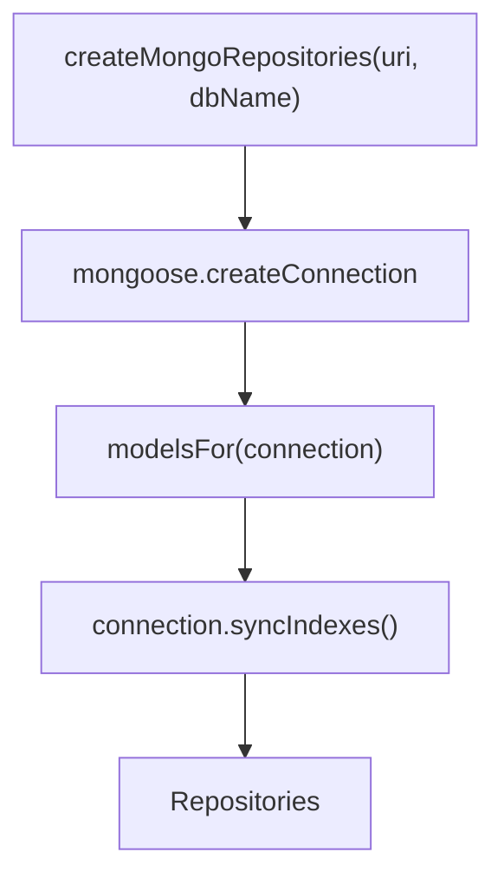
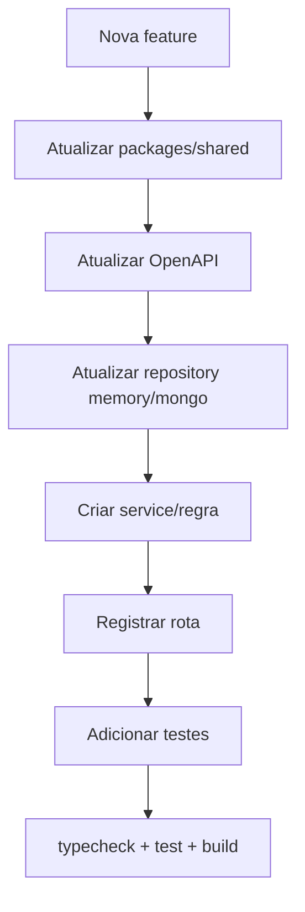

# Operacao, Ambiente e Validacao

Guia pratico para rodar, validar e evoluir o backend.

## Variaveis de ambiente

Arquivo local esperado: `apps/api/.env`.

```env
PORT=4000
MONGODB_URI=mongodb://localhost:27017
MONGODB_DB=soccer_stats
WEB_ORIGIN=http://localhost:3000
SESSION_SECRET=change-me
GOOGLE_CLIENT_ID=
NODE_ENV=development
COOKIE_DOMAIN=
```

| Variavel | Obrigatoria | Uso |
|---|---:|---|
| `PORT` | Nao | Porta da API, default `4000` |
| `MONGODB_URI` | Nao | URI Mongo, default `mongodb://localhost:27017` |
| `MONGODB_DB` | Nao | Banco, default `soccer_stats` |
| `WEB_ORIGIN` | Nao | Origin permitido no CORS |
| `SESSION_SECRET` | Sim em prod | Assinatura de cookie |
| `GOOGLE_CLIENT_ID` | Nao | Login Google |
| `NODE_ENV` | Nao | `development`, `production`, `test` |
| `COOKIE_DOMAIN` | Nao | Dominio do cookie em deploy |

## Rodar localmente

Com Docker Compose:

```bash
docker compose -f docker-compose.dev.yml up --build
```

Somente MongoDB pelo Docker:

```bash
docker compose -f docker-compose.dev.yml up mongo
```

API local:

```bash
pnpm --filter api dev
```

## URLs

- API: `http://localhost:4000`
- Healthcheck: `http://localhost:4000/health`
- OpenAPI UI: `http://localhost:4000/docs`
- OpenAPI JSON: `http://localhost:4000/docs/json`
- API v1: `http://localhost:4000/v1`

## Scripts

```bash
pnpm --filter api dev
pnpm --filter api typecheck
pnpm --filter api test
pnpm --filter api build
pnpm --filter api start
```

Workspace completo:

```bash
pnpm lint
pnpm typecheck
pnpm test
pnpm build
```

## Testes

O backend usa Vitest e `FastifyInstance.inject`, sem precisar subir servidor HTTP real.

Arquivos principais:

- `apps/api/tests/app.test.ts`
- `apps/api/tests/stats.test.ts`

Coberturas atuais:

- signup e sessao.
- criacao de time, campeonato e partida.
- OpenAPI JSON.
- apelidos repetidos com identificadores publicos unicos.
- convite de jogador por identificador publico.
- venue + snapshot em partida.
- lineup, check-in e revisao de sumula.
- validacao de placar contra sumula.
- bloqueio de encerramento duplicado.
- NaBola Card v2, insights e impacto estatistico.
- geracao de rodadas de campeonato liga.
- notificacoes.
- calculo de stats.

## OpenAPI

A documentacao e registrada em `apps/api/src/docs/openapi.ts`.

Ao criar rota nova:

1. Adicione schema JSON em `schemas`.
2. Adicione schema de rota no objeto do dominio.
3. Registre a rota com `{ schema: ... }`.
4. Valide com:

```bash
pnpm --filter api test
```

O teste `expoe o json OpenAPI` garante que `/docs/json` continua funcionando.

## Persistencia e indices

A persistencia Mongo fica em `apps/api/src/repositories/mongo.ts`.



Cuidados:

- Evite declarar o mesmo indice com `index: true` e `schema.index()`.
- Use `runValidators: true` em updates.
- Preserve `versionKey: false` nos schemas atuais.
- Repository converte `_id` para `id` ao retornar dominio.
- O repository em memoria deve acompanhar a interface para testes.

## Uploads

Fotos de perfil usam multipart em:

```text
POST /v1/players/me/photo
```

Arquivos sao salvos em:

```text
apps/api/uploads/
```

O Fastify expoe:

```text
/uploads/*
```

Limites atuais:

- 1 arquivo por request.
- 4 MB por arquivo.
- Apenas JPG, PNG e WebP.
- MIME declarado precisa bater com assinatura basica do arquivo.
- Metadata do upload fica em `player_profiles.photoMetadata`.

## Seguranca atual

Camadas:

- `@fastify/helmet`.
- CORS restrito a `WEB_ORIGIN`.
- Rate limit global.
- Rate limit especifico em auth sensivel.
- Cookie de sessao assinado.
- `httpOnly`.
- `sameSite=lax`.
- `secure` em producao.

Pontos para evoluir:

- revogacao de todas as sessoes do usuario.
- rotacao de `SESSION_SECRET`.
- auditoria de eventos administrativos.
- limite por IP/usuario em endpoints de escrita.
- politica de expiracao real no Mongo para `sessions` se `expiresAt` virar Date.

## Checklist para novas features backend



Checklist textual:

- Tipo de dominio em `packages/shared/src/domain.ts`.
- Schema Zod em `packages/shared/src/contracts.ts`.
- Schema OpenAPI em `apps/api/src/docs/openapi.ts`.
- Repository interface em `apps/api/src/types.ts`.
- Implementacao em `memory.ts` para testes.
- Implementacao em `mongo.ts` para runtime.
- Teste de sucesso.
- Teste de permissao/erro.
- Teste de regra de dominio se houver calculo.

## Troubleshooting

### Warning de indice duplicado no Mongoose

Mensagem parecida:

```text
Duplicate schema index on {"home.teamId":1}
```

Causa comum: declarar `index: true` no campo e tambem `schema.index(...)`.

Correcao: manter apenas uma declaracao. Para campos aninhados, prefira `schema.index(...)`.

### Cookie nao chega no frontend

Verifique:

- `credentials: "include"` no fetch.
- `WEB_ORIGIN` igual ao origin do frontend.
- `sameSite` e `secure` conforme ambiente.
- `COOKIE_DOMAIN` apenas quando necessario.

### OpenAPI quebra no teste

Verifique:

- `$id` duplicado em schema.
- `$ref` para schema inexistente.
- rota registrada com response code nao declarado no schema.

### Stats estranhas

Verifique:

- partida esta `completed`.
- jogador esta em `home.playerIds` ou `away.playerIds`.
- gols estao como `eventLog.type = goal`.
- placar bate com a quantidade de gols por time.
