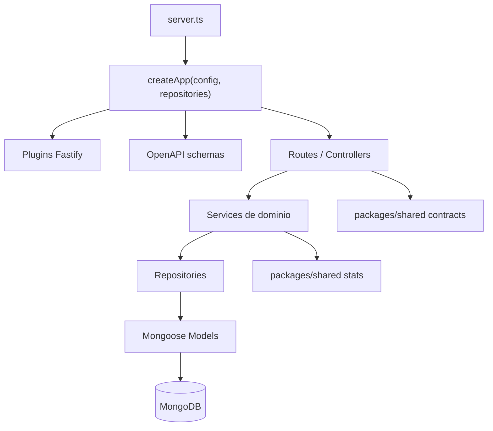
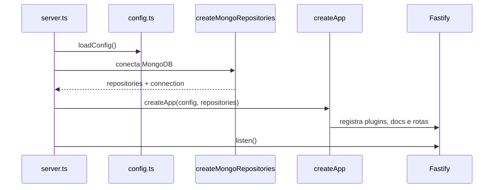
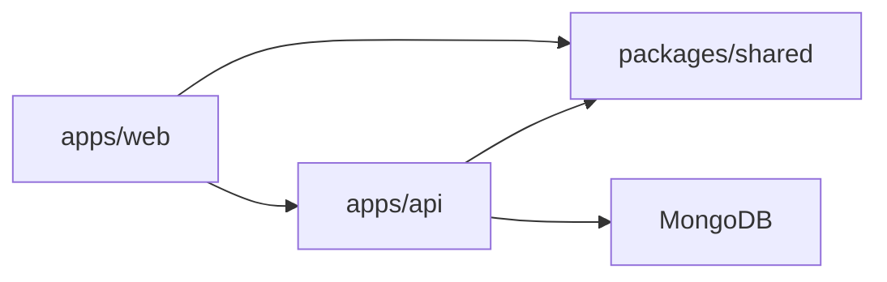
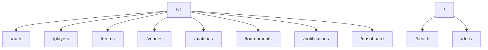

# Visao Geral do Backend

O backend do NaBola e uma API Fastify em TypeScript. Ele concentra autenticacao, autorizacao, regras de dominio, documentacao OpenAPI, persistencia MongoDB e recalculo de estatisticas.

## Stack

- Runtime: Node.js
- Framework HTTP: Fastify 5
- Validacao: Zod
- Banco: MongoDB
- ODM: Mongoose
- Docs HTTP: `@fastify/swagger` + `@fastify/swagger-ui`
- Testes: Vitest + `app.inject`

## Arquitetura de camadas



## Bootstrap



## Dependencias entre pacotes



`packages/shared` e o contrato entre frontend e backend. Ele contem:

- tipos de dominio.
- schemas Zod de input/output.
- funcoes puras de estatistica e rating.

## Principais areas do backend

| Area | Caminho | Responsabilidade |
|---|---|---|
| Bootstrap | `src/server.ts` | Carrega config, conecta Mongo e sobe Fastify |
| App | `src/app.ts` | Registra plugins, OpenAPI, static uploads, rotas e error handler |
| Auth | `src/plugins/auth.ts` | Sessao, cookies, login credentials/Google e `requireUser` |
| OpenAPI | `src/docs/openapi.ts` | Schemas JSON e documentacao Swagger |
| Repositories | `src/repositories/*` | Persistencia Mongo/Memoria |
| Routes legadas | `src/routes/*` | Endpoints principais atuais |
| Modules | `src/modules/*` | Nova organizacao por dominio |
| Stats | `src/lib/stats-service.ts` | Calculo de times, jogadores e standings |

## Rotas registradas

Todas as rotas de produto ficam sob `/v1`.



## Error handling

O `app.ts` registra um error handler para:

- `ZodError`: responde `400` com `Payload invalido`.
- `mongoose.Error.ValidationError`: responde `400` com `Documento invalido`.
- outros erros: seguem para o handler padrao do Fastify.

## Padrao recomendado para novos modulos

```text
apps/api/src/modules/<domain>/
|- <domain>.routes.ts
|- <domain>.controller.ts
|- <domain>.service.ts
|- <domain>.schemas.ts
|- <domain>.model.ts
|- <domain>.repository.ts
```

Use todos os arquivos apenas quando houver complexidade suficiente. Para dominios pequenos, `routes + controller + service` ja basta.
